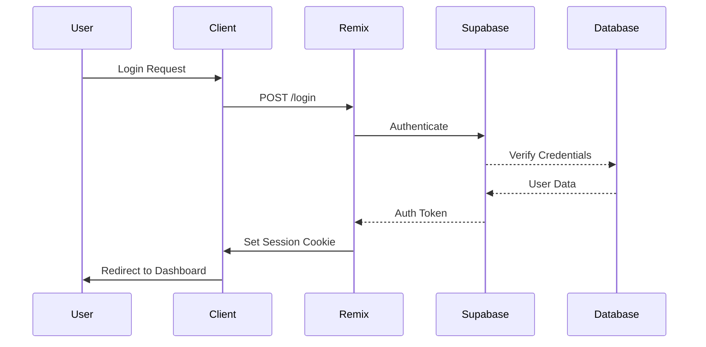

# Application Architecture

## Technology Stack & Decisions

### 1. Frontend Framework: Remix

- **Why Remix?**
  - Server-side rendering (SSR) out of the box
  - Built-in routing and data loading
  - TypeScript support
  - Excellent developer experience
  - Progressive enhancement
  - Built-in error boundaries

### 2. Database & Authentication: Supabase

- **Why Supabase?**
  - Free tier with generous limits
  - PostgreSQL database
  - Built-in authentication
  - Real-time capabilities
  - Row Level Security (RLS)
  - Easy to set up and maintain
  - REST and GraphQL APIs

#### Supabase Setup Guide

1. **Create Supabase Project**

   ```bash
   # Visit https://supabase.com
   # Click "New Project"
   # Fill in project details:
   - Name: your-project-name
   - Database Password: generate a strong password
   - Region: choose closest to your users
   - Pricing Plan: Free tier
   ```

2. **Database Schema Setup**

   ```sql
   -- Users Table
   create table public.users (
     id uuid references auth.users primary key,
     username text unique not null,
     email text unique,
     is_guest boolean default false,
     points integer default 0,
     achievements jsonb default '[]'::jsonb,
     created_at timestamp with time zone default timezone('utc'::text, now())
   );

   -- Enable Row Level Security
   alter table public.users enable row level security;

   -- Policies
   create policy "Users can read own data"
     on public.users for select
     using (auth.uid() = id);

   create policy "Users can update own data"
     on public.users for update
     using (auth.uid() = id);
   ```

3. **Authentication Setup**

   - Navigate to Authentication → Settings
   - Configure Site URL: `http://localhost:3000` (development)
   - Enable Email auth provider
   - Configure email templates (optional)

4. **API Keys & Environment Variables**
   ```env
   # .env file
   SUPABASE_URL=your_project_url
   SUPABASE_ANON_KEY=your_anon_key
   ```

### 3. Session Management

#### Session Secret Generation

1. **Development Environment**

   ```bash
   # Generate a secure random string using Node.js
   node -e "console.log(crypto.randomBytes(32).toString('hex'))"

   # Add to .env file
   SESSION_SECRET=generated_secret_here
   ```

2. **Production Environment (Vercel)**

   ```bash
   # Generate a different secret for production
   node -e "console.log(crypto.randomBytes(32).toString('hex'))"

   # Add to Vercel Environment Variables
   # Dashboard → Project → Settings → Environment Variables
   SESSION_SECRET=generated_production_secret
   ```

#### Session Configuration
```typescript
const sessionStorage = createCookieSessionStorage({
  cookie: {
    name: "_session",
    sameSite: "lax",
    path: "/",
    httpOnly: true,
    secrets: [process.env.SESSION_SECRET],
    secure: process.env.NODE_ENV === "production",
  },
});
```

### 4. Hosting: Vercel

#### Initial Setup

```bash
# Install Vercel CLI
pnpm install -g vercel

# Login to Vercel
vercel login
```

#### Project Configuration

```json
{
  "version": 2,
  "builds": [
    {
      "src": "package.json",
      "use": "@vercel/remix"
    }
  ]
}
```

#### Environment Variables Setup

1. Go to Vercel Dashboard
2. Navigate to Project Settings
3. Add Environment Variables:
   ```env
   SUPABASE_URL=your_production_supabase_url
   SUPABASE_ANON_KEY=your_production_anon_key
   SESSION_SECRET=your_production_session_secret
   ```

## Data Flow Architecture

### 1. Authentication Flow



### 2. Data Structures

#### User Interface

```typescript
interface User {
  id: string;
  email?: string;
  username: string;
  isGuest: boolean;
  points: number;
  achievements: Achievement[];
  createdAt: string;
}
```

#### Achievement Interface

```typescript
interface Achievement {
  id: string;
  name: string;
  description: string;
  points: number;
  unlockedAt?: string;
}
```

## Security Considerations

### 1. Authentication Security

- HTTP-only cookies prevent XSS attacks
- Secure session management with encrypted cookies
- CSRF protection via SameSite cookie attribute
- Rate limiting on authentication endpoints

### 2. Database Security

- Row Level Security (RLS) ensures data isolation
- Prepared statements prevent SQL injection
- Input validation on all user inputs
- Encrypted connections to database

### 3. API Security

- Request validation for all inputs
- Proper error handling and logging
- CORS configuration
- API rate limiting

## Development Workflow

### 1. Local Development

```bash
# Start development server
pnpm dev

# Run type checking
pnpm typecheck

# Run linting
pnpm lint
```

### 2. Deployment

```bash
# Deploy to production
vercel --prod
```

### 3. Environment Management

- Use `.env.local` for local development
- Use Vercel environment variables for production
- Never commit sensitive information to version control

## Monitoring and Logging

### 1. Error Tracking

- Vercel Analytics for performance monitoring
- Console logging for development
- Error boundaries for React component errors

### 2. Performance Monitoring

- Vercel Analytics
- Supabase Dashboard
- Custom logging implementation

```

This architecture document provides:
1. Complete setup instructions
2. Security considerations
3. Development workflow
4. Environment management
5. Monitoring solutions
6. Data structure definitions
```

